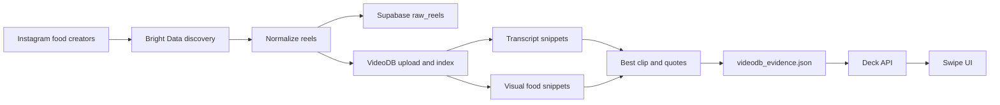

# What To Eat Ah

## The Short Version

**What To Eat Ah** is a mobile-first food decision app for Singapore. It turns trending creator food clips into a swipeable deck of real places you can actually visit.

Instead of opening five apps, scrolling for twenty minutes, and still asking "so what to eat ah?", the user opens one deck, filters by distance or cuisine, swipes through credible food clips, saves the good ones, and leaves with a shortlist.

It is not a restaurant directory. It is not a TikTok clone. It is a dinner decision engine powered by social food evidence.

## Demo

Watch the video demo: https://drive.google.com/file/d/1qWUZW9tXGC6I7ANQ79CRfxWSfIovlN3s/view?usp=sharing

## The Problem

Choosing food in Singapore is weirdly hard because the information is everywhere and nowhere at the same time.

Social feeds show what looks good, but they are built for endless scrolling, not deciding. Map apps show what is nearby, but they rarely capture what is currently exciting. Delivery apps optimize for ordering, not going out. Group chats collect links, but they do not help the group converge.

The result is a familiar loop:

- Someone asks what to eat.
- Everyone sends random links.
- The group opens social videos, map reviews, menus, and distance checks.
- Nobody knows which option is actually worth acting on.

**What To Eat Ah compresses that loop into a fast, physical swipe decision.**

## Product Promise

Open the app. Swipe through a small stack of food options. Save the ones that make sense. Pick from the shortlist.

Each card answers the questions that matter in the moment:

- What dish is this?
- Where is it?
- How far away is it?
- Who recommended it?
- Is there enough social proof?
- Does it match what I seem to like?
- Can I open it in Maps right now?

The product succeeds when the user stops browsing and starts moving.

## Who It Is For

What To Eat Ah is built for people in Singapore deciding what to eat on their phone, usually under light pressure:

- Friends choosing dinner in a group chat.
- Students looking for something nearby after class.
- Office workers deciding lunch without another spreadsheet-level debate.
- Couples looking for a casual date-night option.
- Anyone who trusts creator clips but wants a decision tool, not a feed.

The app assumes the user is not doing deep restaurant research. They want credible, nearby, craveable options fast.

## Core Experience

The first screen is the product. No landing page, no explanation wall, no onboarding maze.

The user sees a phone-sized swipe deck:

- A large food card led by dish imagery or video.
- Dish name, creator, engagement, distance, price, and rating.
- A pull quote from the creator when available.
- A detail layer inside the card with place facts and creator mentions.
- A bottom action rail for nope, undo, save, and details.
- A shortlist button in the top bar.
- A distance slider and cuisine drawer above the deck.

Swiping right saves a card to the user's crawl. Swiping left removes it from the session. The user can undo, open details, filter by cuisine, adjust the distance radius, and jump to Google Maps from the shortlist.

## Why Swipe?

Food decisions are emotional, quick, and comparative. A swipe deck matches that behavior better than a search results page.

Search works when the user knows what they want. What To Eat Ah is for the more common moment: "I am hungry, nearby, and open to being convinced."

The deck creates a finite decision loop:

- One option at a time.
- Clear yes/no action.
- Immediate feedback.
- A shortlist that gets better as the session progresses.

## How Ranking Works

The deck starts with social momentum, then personalizes as the user swipes.

Each clip receives a velocity score based on engagement and recency. Newer, more active clips rise first. As the user swipes, the session updates taste weights across three kinds of tags:

- Cuisine, such as local, Chinese, Malay, Korean, Japanese, Thai, Indian, and more.
- Price band, such as cheap, mid, or treat.
- Vibe, such as comfort, spicy, hawker, supper, sweet, or date-night.

Right swipes increase the weights for that clip's tags. Left swipes reduce them. Personalization ramps up gradually, so the first cards are driven mostly by broad social signal, while later cards reflect what the user is choosing in the current session.

The ranking formula is intentionally simple:

```text
card score = social velocity + personalization ramp * taste match
```

That makes the product explainable. A card appears because it is trending, nearby, and increasingly aligned with the user's taste.

## Filters That Matter

The MVP keeps filters tight because too many filters recreate the restaurant-directory problem.

The current controls are:

- **Distance radius:** 1 km to 15 km.
- **Cuisine:** multi-select drawer with cuisines like local, Malay, Chinese, Japanese, Korean, Thai, Western, Mediterranean, Indian, and others.

The app deliberately keeps vibe tags inside the card instead of making them top-level filters. Vibe should explain why a recommendation fits, not become another configuration chore.

## Shortlist

The shortlist is the payoff.

Saved cards appear in a bottom sheet with:

- Thumbnail.
- Dish name.
- Venue name.
- Distance and rating.
- Direct Maps action.

This keeps the user in the decision flow. They can swipe, compare, and leave with an actionable food crawl without switching routes or losing context.

## Data Model

The product separates social clips from real places.

Clips are the evidence. Places are the canonical destination.

| Object | Purpose |
| --- | --- |
| `Place` | Venue name, address, location, Google rating, price level, distance, map URL |
| `Clip` | Dish, creator, caption, poster/video, engagement, tags, quote, source timing |
| `DeckCard` | A joined place and clip with creator mentions, velocity score, and final score |
| `TasteWeights` | Session-level preference weights learned from swipes |

This distinction matters because multiple creators can mention the same place. The user should not see random duplicate content as separate restaurants. The app can use many clips as supporting evidence for one real-world decision.

## Pipeline

The frontend should feel instant, so heavy video processing happens before the user request.

The repo includes an offline cache pipeline that turns raw creator content into a stable JSON contract the app can read safely.



The VideoDB cache records:

- Original post ID and video URL.
- VideoDB asset ID and stream URL.
- Best clip start/end.
- Transcript snippets.
- Visual snippets.
- Quote candidates.
- TokenRouter-ready input.
- Processing status and per-row errors.

Failed or partial rows do not block the deck. The pipeline is designed to degrade gracefully.

## API Surface

The app exposes two focused routes:

| Route | Job |
| --- | --- |
| `GET /api/deck` | Returns ranked cards for distance and cuisine filters |
| `POST /api/swipe` | Accepts a left/right swipe, updates taste weights, and returns the next ranked cards |

The client stores session state in `sessionStorage`, including seen clip IDs, saved cards, taste weights, distance radius, and selected cuisines. This keeps the MVP lightweight: no login is required to get a personalized session.

## Tech Stack

The product is built as a Next.js app with a data pipeline around it.

- **Frontend:** Next.js App Router, React, TypeScript, Tailwind CSS.
- **UI system:** Mobile-first CSS, Archivo display type, Instrument Sans body type, lucide-react icons.
- **Recommendation logic:** Local ranking utilities for social velocity, tag weights, and distance filtering.
- **Storage and ingestion:** Supabase pipeline scripts for raw reels and processed evidence.
- **Content acquisition:** Bright Data scripts for Instagram creator discovery.
- **Video understanding:** VideoDB for food audio indexing, visual indexing, search, best clip extraction, and quote candidates.

## What Makes It Different

Most food products start from one of three places: search, delivery, or content.

What To Eat Ah starts from the decision.

That changes the shape of the product:

- It is finite, not endless.
- It is place-aware, not just content-aware.
- It uses social proof without becoming a social feed.
- It learns from swipes without needing account setup.
- It treats video as evidence, not entertainment.
- It turns "this looks good" into "we can go there."

## Demo Story

Start with the line everyone knows:

> "What to eat ah?"

Then show the app opening directly into the deck.

1. Adjust distance to keep options realistic.
2. Swipe left on something that does not fit.
3. Swipe right on something craveable.
4. Show the taste bars updating after a few swipes.
5. Open details to show the venue, distance, rating, creator evidence, and quote.
6. Open the shortlist.
7. Tap Maps.

The demo lands because the product does not explain decision-making. It performs it.

## Current MVP

The MVP already demonstrates the full loop:

- Swipeable mobile deck.
- Distance and cuisine filters.
- Left/right swipe actions with button fallbacks.
- Undo.
- Saved shortlist.
- Maps handoff.
- Session-based personalization.
- Ranking by social velocity and taste match.
- Offline VideoDB evidence cache tooling.
- Bright Data and Supabase ingestion scripts.

## Next Bets

The strongest next steps are:

- Real user location instead of static distance values.
- Opening hours and "open now" filtering.
- Group mode for shared shortlists and convergence.
- Better duplicate handling across creators and dishes.
- Dietary filters that stay simple, such as halal, vegetarian, spicy tolerance, and budget.
- Productionized evidence generation from VideoDB cache into deck cards.
- Stronger place enrichment with canonical venue IDs.

## Product North Star

The north star is not watch time. It is decision time.

**How quickly can a hungry person go from "what to eat ah?" to a shortlist they trust?**

Every feature should make that loop faster, more credible, or more locally relevant.

## One-Line Pitch

**What To Eat Ah turns Singapore food creator clips into a swipeable, personalized dinner shortlist you can act on immediately.**
